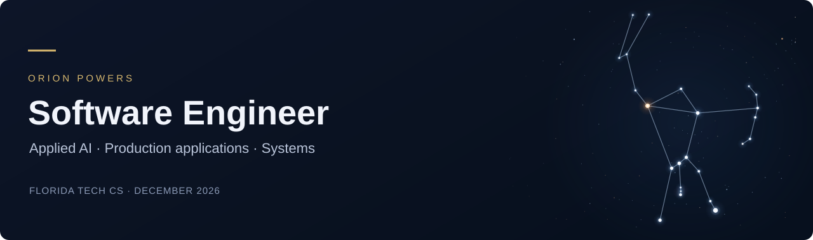

  

  <a href="https://orionpowers.com"><strong>Portfolio</strong></a> &nbsp;·&nbsp;
  <a href="https://www.linkedin.com/in/orion-powers/"><strong>LinkedIn</strong></a> &nbsp;·&nbsp;
  <a href="mailto:orionthanhpowers@gmail.com"><strong>Contact</strong></a>

I build interfaces and applications that make complex workflows easier to understand—from intelligence analysis and logistics to local AI evaluation and document processing.

I'm a **Software Engineer Intern at Modus Operandi** and a **Computer Science student at Florida Tech**, graduating **December 2026**. I've served as lead UI engineer on production applications, delivered SaaS features end to end, and built applied machine-learning workflows.

**Available for full-time software engineering roles starting January 2027.** Based in Melbourne, Florida · U.S. citizen.

## Engineering experience

- **Modus Operandi:** Build Angular/TypeScript applications for Air Force and Navy programs, including interactive graph analysis, LLM query provenance, live API dashboards, and role-based interfaces. In a logistics application, upgraded Angular 19 → 21, raised automated line coverage **78% → 98%**, and resolved **9 dependency CVEs**. Work includes formal code review, Docker validation, CI quality gates, and direct analyst feedback.
- **Hyperformant:** Delivered SaaS features from Figma designs through deployment using React, TypeScript, Node.js APIs, Supabase/PostgreSQL, and OAuth 2.0.
- **RARE T Holdings:** Built an Azure ML/Python/Java document-processing pipeline that **doubled accounting throughput**; automated approval workflows that reduced cycle time **40%**.

## Selected projects

| Project | What it demonstrates | Explore |
| --- | --- | --- |
| **Receipt Review Workbench** | Trained receipt extraction, actual OCR evaluation on 100 CORD receipts, and a working review application with line-item correction, version checks, and audit history. Image-to-total-field F1: **0.795**. | [Demo](https://p-orion.github.io/receipt-review-ml/) · [Code & measured results](https://github.com/P-Orion/receipt-review-ml) |
| **FleetSignal** | Remaining-life forecasting on NASA simulated engines, causal sensor features, whole-engine holdouts, and prediction intervals. Validation-selected model: **16.97 cycles RMSE** on 100 test engines with capped targets; age-only baseline: 37.77. | [Fleet explorer](https://p-orion.github.io/fleet-signal-ml/) · [Code & benchmark](https://github.com/P-Orion/fleet-signal-ml) |
| **LLM Eval Lab** | **640 recorded requests across two local models**, resumable task leases, strict numerical verification, paired uncertainty, and inspectable raw responses. Full experiments pin model/data/source identities. Independent follow-up inspired by BrainBench. | [Experiment browser](https://p-orion.github.io/llm-eval-lab/) · [Code & recorded runs](https://github.com/P-Orion/llm-eval-lab) |
| **BrainBench** | Local LLM evaluation, mathematical reasoning analysis, and interactive research visualization. Senior design collaboration; co-authored paper **under peer review**. | [Dashboard](https://p-orion.github.io/) · [Repository](https://github.com/P-Orion/P-Orion.github.io) |
| **LLM Network Analyzer** | Python/FastAPI packet analysis, six heuristic anomaly categories, local Ollama inference, and an Angular dashboard with WebSocket progress. | [Code & walkthrough](https://github.com/P-Orion/LLM-Powered-Network-Analyzer) |
| **Orion Portfolio** | Responsive web development, custom interaction design, and static-site deployment. | [Live site](https://orionpowers.com) · [Repository](https://github.com/P-Orion/Space-Resume-Site) |

## Core technologies

**Languages:** TypeScript · JavaScript · Python · Java · SQL · C++ 
**Applications:** Angular · React · RxJS · GoJS · FastAPI · Node.js · Spring Boot 
**Data & AI:** PostgreSQL · Supabase · Azure Machine Learning · scikit-learn · NumPy · OCR · Ollama · Scapy 
**Delivery:** Git · Docker · Bitbucket CI/CD · SonarQube · Keycloak

## Beyond the code

Founder & President of Florida Tech's Computer Science Networking Society. FPV Division Executive in the Drone Club. I also build with Fusion 360, 3D printing, laser engraving, and NFC hardware.

[More about my work, experience, and résumé →](https://orionpowers.com)
